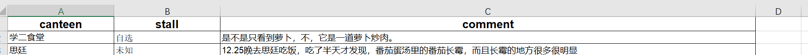
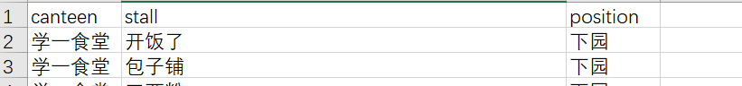
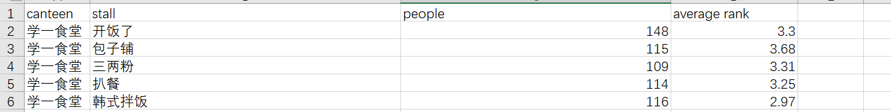
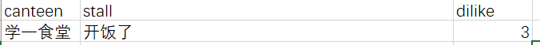
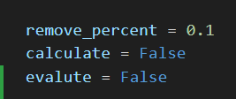
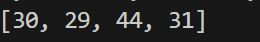

# How to run our code

## Input requirement

The whole program is a model for ranking the stalls in all canteen. The students' ratings for each stall, the complaints each stall received, the distance between stalls, the similarity, and the revenue of stalls are all consider in this model and the corresponding rankings are packaged in separate files. Users just need to fill in all of the Excel files in the 'data' folder before running the program. 

The first Excel is complaint.xlsx. The first column is the canteen's name and the second one is the stall's name. The last one is the corresponding complaint. Here is an example:

The second Excel is stall_canteen_campus.xlsx. It stores the information of each stall and its position (i.e. in upper campus or lower campus). The first column is the canteen's name and the second one is the stall's name. The last one is the corresponding campus. Here is an example:

The third Excel is stall_rating.xlsx. It stores the rating of each stall given by students. The first column is the canteen's name and the second one is the stall's name. The third one is the number of people who rate this stall. The last one is the corresponding rating. Here is an example:

If the user gets more data about the stalls that students hope to remove and want to retrain the model, they need to first update the stall_want_to_remove.xlsx and then run the program again. The Excel file is shown here. The first column is the canteen's name and the second one is the stall's name. The third one is the number of people who dislike this stall. 

## Complaint analysis

## Setting parameters and getting the result!

There are three parameters that the user needs to set. The first one is remove_percentage. This is telling the program how many stalls you want to remove. For example, if the total amount of stalls is 100 and the user wants to remove 10 stalls, he/she can set this parameter to 0.1. The second parameter is called calculate. This parameter is to tell the program whether it needs to retrain the model and return a new group of weights that minimize the cost. The third parameter is whether to return the evaluation result of the current group of weights. 

After setting the program, the user can run the program by "python main.py" and get the stalls to be removed. The outputs are the indexes of the stalls that need to be removed:

